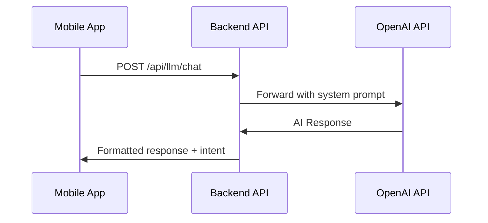

import FullscreenDiagram from '@site/src/components/FullscreenDiagram';

# AI Assistant

The Rituals App features an intelligent AI Assistant powered by **OpenAI GPT-4**, designed to act as a personal habit coach.

## Capabilities

The AI Assistant is accessible via the "Chat" tab and provides:

### Conversational Features
*   **Motivation:** Provides encouragement and tips for maintaining streaks
*   **Q&A:** Answers questions about habit formation and productivity techniques
*   **Personalized Advice:** Offers suggestions based on your ritual history

### Intent-Based Actions 🚀

The AI can take **in-app actions** when you ask:

| Intent | Example Prompt | Action |
| :--- | :--- | :--- |
| **Create Ritual** | "Create a meditation ritual at 7 AM" | Opens ritual creation with pre-filled data |
| **Show Stats** | "How am I doing this week?" | Navigates to statistics screen |
| **Check Streaks** | "What's my longest streak?" | Displays streak information |

<FullscreenDiagram definition={`
flowchart LR
    User[User Message] --> AI[AI Processing]
    AI --> Intent{Intent Detected?}
    
    Intent -->|Yes| Action[Execute Action]
    Intent -->|No| Response[Text Response]
    
    Action --> Create[Create Ritual]
    Action --> Navigate[Navigate to Screen]
    Action --> Display[Display Stats]
    
    style Action fill:#9cf,stroke:#09f
`} />

## Security & Privacy

We prioritize user safety and data privacy in our AI implementation.

### Content Filtering

The application implements a **client-side security service** that pre-validates user input:

*   **Allowed Topics:** Rituals, habits, productivity, well-being, motivation
*   **Filtered Topics:** Violence, illegal activities, harmful content
*   **Safe Responses:** Blocked inputs receive a helpful redirect message

### Data Privacy

*   Chat history is stored locally on device
*   Only the current message is sent to the AI
*   No personal data is shared with third parties

## Usage & Limits

### Free Users
*   Unlimited AI interactions
*   Standard response times
*   Full intent action support

### Premium Users
*   Priority processing
*   Enhanced response quality
*   Exclusive coaching features

> **Note:** Rate limiting has been removed for all users as of December 2024.

## Technical Implementation

### Backend Flow

### System Prompt

The AI is configured with a specialized system prompt that:
1. Focuses responses on habit-building topics
2. Maintains a supportive, encouraging tone
3. Provides actionable advice
4. Recognizes intent patterns for in-app actions
